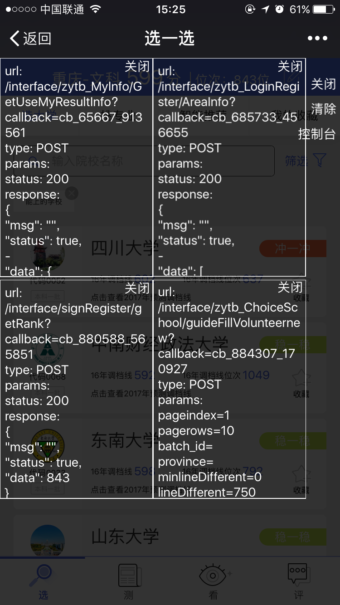

# Ajax Watcher

轻量级网络请求调试工具，专为移动端/微信等难以调试的环境设计。

A lightweight network request debugger designed for mobile/WeChat and other hard-to-debug environments.

[](https://www.npmjs.com/package/ajax-watcher)
[](https://github.com/AJLoveChina/ajax-watcher/blob/master/LICENSE)



## ✨ 特性 / Features

- 🔍 **同时拦截 XHR 和 Fetch** - 完整覆盖现代 Web 应用的网络请求
- 📱 **移动端优化** - 专为手机浏览器、微信内置浏览器等环境设计
- ⏱️ **时限调试** - 设置调试持续时间，自动关闭防止泄露
- 💾 **状态持久化** - 刷新页面自动恢复调试状态
- 🎨 **现代化 UI** - 美观的浮动面板，支持 JSON 折叠展示
- 📦 **零依赖** - 不依赖 jQuery 或其他库
- 🔌 **Vue 3 支持** - 可选的 Vue 插件适配器
- 📝 **TypeScript** - 完整的类型定义

## 📦 安装 / Installation

### npm / yarn / pnpm

```bash
npm install ajax-watcher
# or
yarn add ajax-watcher
# or
pnpm add ajax-watcher
```

### CDN

```html
<script src="https://unpkg.com/ajax-watcher/dist/ajax-watcher.global.js"></script>
<script>
  ajaxWatcher.open();
</script>
```

## 🚀 快速开始 / Quick Start

### ES Module

```typescript
import { ajaxWatcher } from 'ajax-watcher';

// 开启调试（默认 5 分钟后自动关闭）
ajaxWatcher.open();

// 自定义配置
ajaxWatcher.open({
  keepingTime: 10 * 60 * 1000, // 10 分钟
  autoShow: true,              // 自动显示面板
  console: true,               // 控制台输出日志
});

// 手动关闭
ajaxWatcher.close();
```

### Vue 3

```typescript
import { createApp } from 'vue';
import { ajaxWatcherPlugin } from 'ajax-watcher/vue';
import App from './App.vue';

const app = createApp(App);

app.use(ajaxWatcherPlugin, {
  autoOpen: true,
  keepingTime: 10 * 60 * 1000,
});

app.mount('#app');
```

在组件中使用：

```vue
<script setup>
import { useAjaxWatcher } from 'ajax-watcher/vue';

const watcher = useAjaxWatcher();

function toggleDebug() {
  if (watcher.isActive()) {
    watcher.close();
  } else {
    watcher.open();
  }
}
</script>
```

## 📖 API 文档 / API Reference

### `ajaxWatcher.open(options?)`

开启调试模式。

**参数 / Parameters:**

| 参数 | 类型 | 默认值 | 说明 |
|------|------|--------|------|
| `keepingTime` | `number` | `300000` (5分钟) | 调试持续时间（毫秒） |
| `autoShow` | `boolean` | `true` | 是否自动显示调试面板 |
| `console` | `boolean` | `true` | 是否在控制台输出日志 |
| `interceptXHR` | `boolean` | `true` | 是否拦截 XMLHttpRequest |
| `interceptFetch` | `boolean` | `true` | 是否拦截 fetch API |
| `maxRecords` | `number` | `100` | 最大记录请求数 |
| `filter` | `(request) => boolean` | - | 请求过滤器 |
| `onRequest` | `(request) => void` | - | 请求回调 |
| `panelPosition` | `string` | `'bottom-right'` | 面板位置 |
| `triggerPosition` | `string` | `'bottom-right'` | 触发按钮位置 |

### `ajaxWatcher.close()`

关闭调试模式，清除存储的配置。

### `ajaxWatcher.show()` / `ajaxWatcher.hide()` / `ajaxWatcher.toggle()`

控制调试面板的显示/隐藏。

### `ajaxWatcher.isActive()`

检查是否处于调试状态。

### `ajaxWatcher.getRequests()`

获取所有已记录的请求列表。

### `ajaxWatcher.clearRequests()`

清除所有已记录的请求。

### `ajaxWatcher.on('request', callback)`

监听请求事件，返回取消监听的函数。

```typescript
const unsubscribe = ajaxWatcher.on('request', (request) => {
  console.log('New request:', request);
});

// 取消监听
unsubscribe();
```

### `ajaxWatcher.destroy()`

销毁实例，恢复原始的 XHR 和 fetch。

## 🔄 从 v1.x 迁移 / Migration from v1.x

### 主要变化

1. **移除 jQuery 依赖** - v2.0 完全不依赖 jQuery
2. **新增 Fetch 拦截** - 同时支持 XHR 和 Fetch API
3. **TypeScript 支持** - 完整的类型定义
4. **模块化导出** - 支持 ESM、CJS 和 IIFE 格式

### API 对照

```javascript
// v1.x (旧版)
ajaxWatcher.open({
  jquery: true,      // ❌ 已移除
  keepingTime: 300000,
  console: true,
  autoShow: true
});

// v2.x (新版)
ajaxWatcher.open({
  keepingTime: 300000,
  console: true,
  autoShow: true,
  interceptXHR: true,   // ✅ 新增
  interceptFetch: true  // ✅ 新增
});
```

### Vue 插件迁移

```javascript
// v1.x
import ajaxWatcher from './vue-plugin/ajax-watcher';
Vue.use(ajaxWatcher);
Vue.prototype.$http = ajaxWatcher.$http;

// v2.x
import { ajaxWatcherPlugin } from 'ajax-watcher/vue';
app.use(ajaxWatcherPlugin);
// $http 已移除，请直接使用 fetch 或 axios
```

## 🏃 运行 Demo / Run Demo

```bash
# 安装依赖
npm install

# 启动开发服务器
npm run dev

# 运行测试
npm test

# 构建
npm run build
```

## 💡 使用场景 / Use Cases

### 移动端调试

在微信内置浏览器、APP WebView 等无法打开开发者工具的环境中调试网络请求。

### 生产环境临时调试

通过设置页面让特定用户临时开启调试模式，排查线上问题。

```html
<!-- settings.html -->
<button onclick="ajaxWatcher.open({ keepingTime: 5 * 60 * 1000 })">
  开启调试（5分钟）
</button>
```

### 请求监控

```typescript
ajaxWatcher.on('request', (request) => {
  if (request.state === 'error') {
    // 上报错误请求
    reportError(request);
  }
});
```

## 📝 注意事项 / Notes

1. **调试时间限制** - `keepingTime` 设计用于防止调试状态意外暴露在生产环境
2. **存储持久化** - 调试配置保存在 `localStorage`，键名为 `ajax-watcher`
3. **请求数量限制** - 默认最多保留 100 条请求记录，防止内存溢出
4. **Service Worker** - 目前不拦截 Service Worker 发起的请求

## 🤝 贡献 / Contributing

欢迎提交 Issue 和 Pull Request！

## 📄 License

MIT © [vldh](https://github.com/AJLoveChina)
